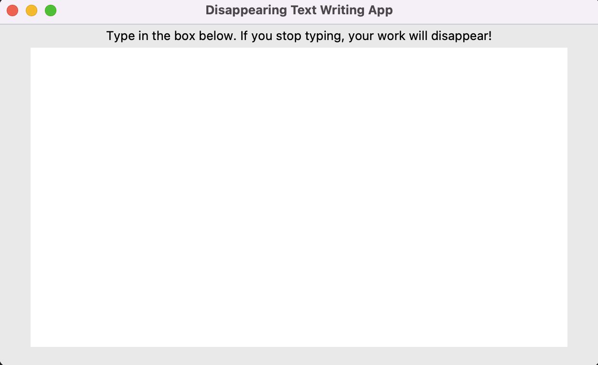

# Disappearing Text Writing App
The Disappearing Text Writing App is a simple Python application that allows you to write text in a text box. If you stop typing, your work will disappear after three seconds.

